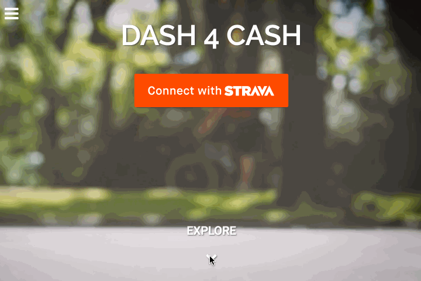

# [Dash 4 Cash](http://dash-4-cash.cfsanderson.surge.sh)

Dash 4 Cash is my capstone project for the Front-End Engineering program at The Iron Yard in St. Petersburg, FL. I came up with D4C as a way to merge my love of running (and running data) with the ability to support charitable organizations through group accountability and competition.

D4C uses Auth0 to authenticate users and pull in their running data from Strava.com. Users can then create groups and invite friends to those groups which are centered around a day, week, or month long "Dash". At the end of the "dash" the group member that has the most miles or minutes wins the total of the group's charitable donations for their charity of choice. The social accountability and healthy competition that are created help to keep people motivated to not just run, but run with purpose.

There are a few features of the app that are not fully functional yet (credit card donations, email notifications,  etc.) but it does have mechanisms for all of the data and a fully functional GraphQL database backend that is hosted by GraphCool. Depending on future interest, I'd like to complete D4C and make it a fully featured production app.

My personal goals for this project were to create a data-driven fitness app that was not overly aggressive in feel and would seem welcoming to everyone whether they were a seasoned runner or not. To help with this visually, I went for a dark theme with splashes of bright color and a relatively flat design. It was also important to me to make it responsive for good mobile, tablet, and desktop experiences without the use of templates or heavy-handed libraries.

The main technologies used in D4C are React, MobX, and GraphQL with the other usual suspects - HTML, CSS, and JavaScript.

I'd also like to thank my instructor, Jason Perry and fellow Iron Yard students for all their help along the way. I hope you like Dash 4 Cash and if you have any suggestions please feel free to contact me here on GitHub or at my website [CalebSanderson.com](calebsanderson.com)

## TODO / Task List
 
### General
- [x] page automatically scrolls to the top of a page when changing pages
- [ ] close navbar with click anywhere OUTSIDE the nav.
- [ ] add payment collection possibly using Tilt?
- [ ] add email client for invitations and win/loss notifications.
- [ ] switch to horizontal navbar instead of hamburger on desktop view (hamburger on mobile only)

### Home Page
- [x] after authentication with Strava, direct users to Profile page.

#### Home Page Stretch Goals...
- [ ] add progress indicators (dots?)
- [ ] Parallax effect on main content?

### Profile Pages
- [x] style for displaying MyStats
  - [x] separate/distinguish the info groups
  - [x] style "today" stats bigger/better
- [x] Donate button that brings up DonateModal
- [x] separate donation modules for
  - [x] profile page (showing my TOTAL donations & my group's TOTAL donations)
  - [x] group page (showing my total donations TO THAT GROUP and the TOTAL DONATIONS OF THAT GROUP - sorry for shouting)

### My Groups Pages
- [x] # of current members displayed in each segment
- [x] Add members button
- [x] style input field to create new Groups
- [x] increment the number of members as they are added
- [ ] better instruction text for how to start a new group.
- [ ] style group links

### Individual Group Pages
- [x] basic style for leaderboard and make as a component
- [x] Group name in header
- [x] add Members button.
- [x] profile pics in leaderboard, if no pic then display "fa-user-o"

### Add Members modal
- [ ] better text

### Donate modal
- [x] populate "Choose a Group" drop-down selector with groups that the user is in
- [x] Styling for the group drop-down selector (not showing up on iPad or mobile)

### CreateNewGroup modal
- [x] empty form after creating a group
- [x] prevent yellow active glow
- [ ] option to delete a group?

### InnerFooter
- [x] style similar to main footer
- [x] stick to bottom of page

### About Pages
- [ ] more compelling content text "start with why"
- [x] basic styling
  - [x] 2 column chunks on screens wider than 640, 3 columns on full desktop.

### Contact
- [ ] better content text
- [ ] basic email form and social media links?

### Help
- [ ] better content text
- [ ] breadcrumbs for
  - [ ] create a group
  - [ ] delete a group
  - [ ] make a donation
  - [ ] FAQs
- [ ] if a member of a group wins their weekly "dash" the total given to the group for that week goes to the charity of their choice.
